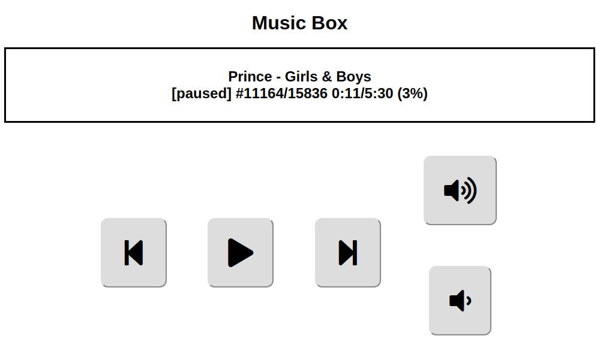

# MusicBox Web User Interface



_[mpd](https://www.musicpd.org/)_+_[mpc](https://www.musicpd.org/clients/mpc/)_ to control playlist and play

_[amixer](https://linux.die.net/man/1/amixer)_ to control sound volume

_[Python Flask](https://en.wikipedia.org/wiki/Flask_\(web_framework\))_ to serve web pages and provide RESTful APIs

Various scripts are run on system startup from:

``/etc/rc.local``

<details>

```bash
#!/bin/sh -e
#
# rc.local
#
# This script is executed at the end of each multiuser runlevel.
# Make sure that the script will "exit 0" on success or any other
# value on error.
#
# In order to enable or disable this script just change the execution
# bits.
#
# By default this script does nothing.

# Print the IP address
_IP=$(hostname -I) || true
if [ "$_IP" ]; then
  printf "My IP address is %s\n" "$_IP"
fi

sudo /home/trevorde/mpd-ui/MusicMonitor.py &
sudo /home/trevorde/mpd-ui/WhatsPlaying.py &
sudo python /home/trevorde/mpd-ui-web/index.py &

exit 0
```

</details>
<br />

mpd is controlled by a config file at:

``/etc/mpd.conf``

<details>

```
# An example configuration file for MPD.
# Read the user manual for documentation: http://www.musicpd.org/doc/user/
# or /usr/share/doc/mpd/user-manual.html


# Files and directories #######################################################
#
# This setting controls the top directory which MPD will search to discover the
# available audio files and add them to the daemon's online database. This 
# setting defaults to the XDG directory, otherwise the music directory will be
# be disabled and audio files will only be accepted over ipc socket (using
# file:// protocol) or streaming files over an accepted protocol.
#
music_directory			"/media/usb"

#
# This setting sets the MPD internal playlist directory. The purpose of this
# directory is storage for playlists created by MPD. The server will use 
# playlist files not created by the server but only if they are in the MPD
# format. This setting defaults to playlist saving being disabled.
#
playlist_directory		"/media/usb/_playlists"

#
# This setting sets the location of the MPD database. This file is used to
# load the database at server start up and store the database while the 
# server is not up. This setting defaults to disabled which will allow
# MPD to accept files over ipc socket (using file:// protocol) or streaming
# files over an accepted protocol.
#
db_file			"/var/lib/mpd/tag_cache"

# 
# These settings are the locations for the daemon log files for the daemon.
# These logs are great for troubleshooting, depending on your log_level
# settings.
#
# The special value "syslog" makes MPD use the local syslog daemon. This
# setting defaults to logging to syslog, otherwise logging is disabled.
#
#log_file			"/var/log/mpd/mpd.log"

#
# This setting sets the location of the file which stores the process ID
# for use of mpd --kill and some init scripts. This setting is disabled by
# default and the pid file will not be stored.
#
pid_file			"/run/mpd/pid"

#
# This setting sets the location of the file which contains information about
# most variables to get MPD back into the same general shape it was in before
# it was brought down. This setting is disabled by default and the server 
# state will be reset on server start up.
#
state_file			"/var/lib/mpd/state"

#
###############################################################################


# General music daemon options ################################################
#
# This setting specifies the user that MPD will run as. MPD should never run as
# root and you may use this setting to make MPD change its user ID after
# initialization. This setting is disabled by default and MPD is run as the
# current user.
#
user				"mpd"

#
# This setting sets the address for the daemon to listen on. Careful attention
# should be paid if this is assigned to anything other then the default, any.
# This setting can deny access to control of the daemon. Choose any if you want
# to have mpd listen on every address
#
# For network
bind_to_address		"localhost"

#
# This setting enables automatic update of MPD's database when files in 
# music_directory are changed.
#
auto_update    "yes"

# Input #######################################################################
#

input {
        plugin "curl"
#       proxy "proxy.isp.com:8080"
#       proxy_user "user"
#       proxy_password "password"
}

#
###############################################################################

# Audio Output ################################################################
#
# MPD supports various audio output types, as well as playing through multiple 
# audio outputs at the same time, through multiple audio_output settings 
# blocks. Setting this block is optional, though the server will only attempt
# autodetection for one sound card.
#
# An example of an ALSA output:
#
audio_output {
	type		"alsa"
	name		"Device"
#	device		"hw:0,0"	# optional
#	mixer_type      "hardware"      # optional
#	mixer_device	"default"	# optional
#	mixer_control	"PCM"		# optional
#	mixer_index	"0"		# optional
}
###############################################################################

# Character Encoding ##########################################################
#
# If file or directory names do not display correctly for your locale then you 
# may need to modify this setting.
#
filesystem_charset		"UTF-8"
#
# This setting controls the encoding that ID3v1 tags should be converted from.
#
id3v1_encoding			"UTF-8"
#
###############################################################################
```

</details>
